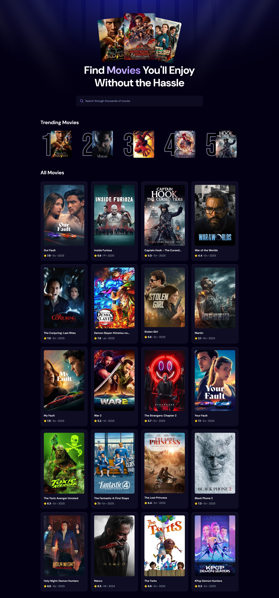

## 1. moodflix
A movie viewing front-end webpage. 

It fetches data through TMDB API and uses Appwrite as backend service to store users' search records for the trending movies list.

It is a practice project from the tutorial: https://www.youtube.com/watch?v=dCLhUialKPQ&t=308s